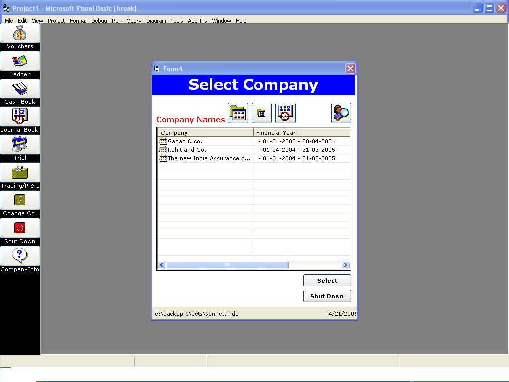

<div align="center">

## Accounting Software with Balance Sheet


</div>

### Description

CAsh Book, Bank Book, Journal Book, Combined Book, Balance Sheet, P & L, List of Account,

<a href="http://www.ixwebhosting.com/templates/ix/v2/affiliate/clickthru.cgi?id=mahvisions"></a>
 
### More Info
 
Visual Basic, SQL Server, MS Access, COM DCOM, ACtiveX, Classes, Chilkat components, TPC SDK, Nokia SDK, ASP.Net


<span>             |<span>
---                |---
**Submitted On**   |2006-04-21 08:20:52
**By**             |[deepgags](https://github.com/Planet-Source-Code/PSCIndex/blob/master/ByAuthor/deepgags.md)
**Level**          |Advanced
**User Rating**    |4.5 (109 globes from 24 users)
**Compatibility**  |VB 5\.0, VB 6\.0, VBA MS Access
**Category**       |[Databases/ Data Access/ DAO/ ADO](https://github.com/Planet-Source-Code/PSCIndex/blob/master/ByCategory/databases-data-access-dao-ado__1-6.md)
**World**          |[Visual Basic](https://github.com/Planet-Source-Code/PSCIndex/blob/master/ByWorld/visual-basic.md)
**Archive File**   |[Accounting1989014222006\.zip](https://github.com/Planet-Source-Code/deepgags-accounting-software-with-balance-sheet__1-65080/archive/master.zip)

### API Declarations

```
For Missing ocx please download from www.amebasoftwares.com/acts/acts.zip
<a href="http://www.ixwebhosting.com/templates/ix/v2/affiliate/clickthru.cgi?id=mahvisions"></a>
```


